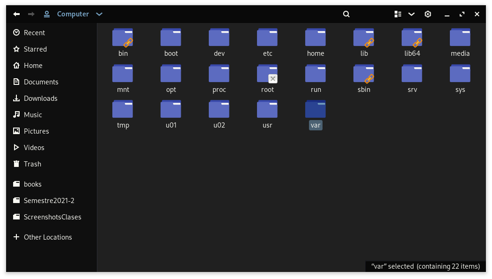
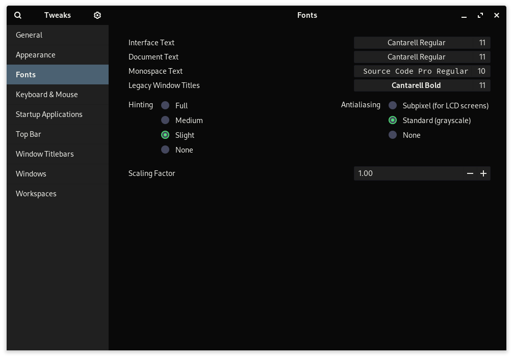

Este es un fork de https://github.com/EliverLara/Ant la cual se puede encontrar en https://www.gnome-look.org/p/1099856/ .
Esta nueva personalizacion manera los colores negro y azul como tema principal.





See also: https://github.com/GuillermoGAndres/Dracula

#### Installation

Extract the zip file to the themes directory i.e. `/usr/share/themes/` or `~/.themes/` (create it  if necessary).

To set the theme in Gnome, run the following commands in Terminal,

```
gsettings set org.gnome.desktop.interface gtk-theme "Ant-Dracula"
gsettings set org.gnome.desktop.wm.preferences theme "Ant-Dracula"
```
or Change via distribution specific tool.

### Note:
* This theme is based on the [evopop-gtk-theme](https://github.com/solus-project/evopop-gtk-theme).
